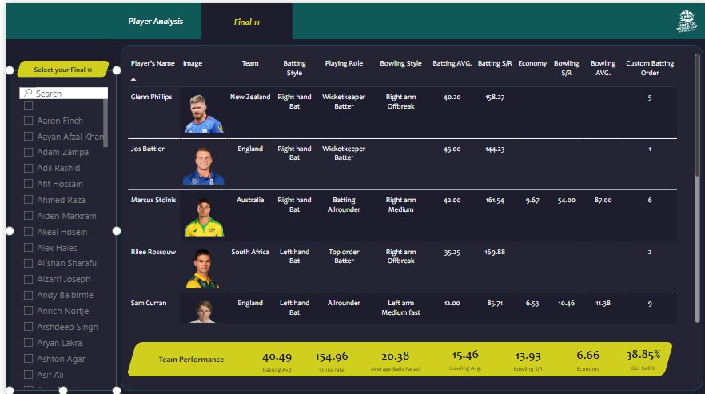
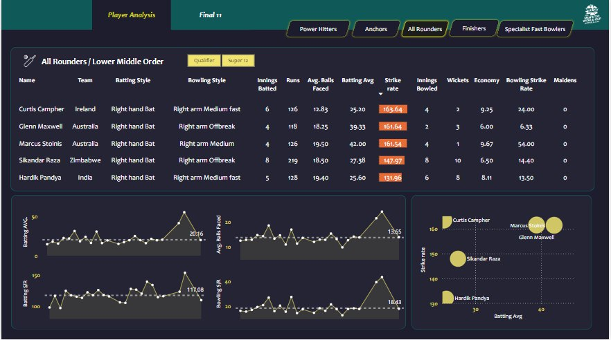

# Cricket Best 11 Analysis Dashboard

Welcome to the **Cricket Best 11 Analysis Dashboard**, a Power BI-based interactive platform designed to help you analyze and select the best playing 11 for cricket teams using detailed player statistics and performance data.

### Demo





## Features

- **Power BI Integration**: Built with Power BI to provide seamless data visualization and interactive reports.
- **Team Selection**: Analyze and select the best playing 11 based on various performance metrics.
- **Data Insights**: Gain insights into individual player performance, team strategies, and comparisons across key statistics.
- **Interactive Dashboard**: Offers interactive charts, tables, and filters for in-depth analysis.
- **Data Filtering**: Filter players by batting, bowling, fielding, or all-rounder roles.
- **Responsive Design**: Accessible across desktop, tablet, and mobile devices.

## How to Use

1. Clone the repository to your local machine:
    ```bash
    git https://github.com/AdityaSrivastavDS/Cricket-Best-11-Analysis-Dashboard
    ```

2. Open the Power BI file (`Cricket Best 11 Analysis Dashboard.pbix`) in [Microsoft Power BI Desktop](https://powerbi.microsoft.com/desktop/).

3. Interact with the dashboard by using filters and slicers to analyze different player combinations and select the best possible team.

4. Export reports or share insights through Power BI service if needed.

## Requirements

- **Power BI Desktop**: Download and install from [here](https://powerbi.microsoft.com/desktop/).
- **Data Source**: The dashboard uses cricket player statistics, which can be updated or modified based on available datasets.


## Data Sources

- Player statistics such as batting averages, bowling economy, strike rates, etc.
- Team performance data for different international and domestic cricket teams.

## Contributing

If you'd like to contribute to the dashboard or enhance its features, feel free to fork the repository, make your changes, and submit a pull request!

## License

This project is licensed under the MIT License. See the `LICENSE` file for more details.


